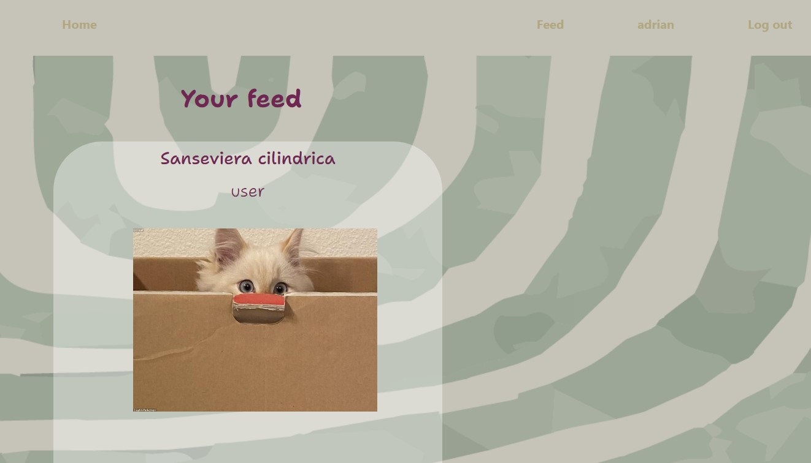

# 🌿 Be Plant Friendly 🌿

Welcome to the frontend of our social network designed to connect people who love plants and nature! 🌱🌸

This frontend is closely integrated with the [Backend-social-network](https://github.com/marinaescriva/Backend-redsocial-hi-its-me), providing a seamless experience for plant enthusiasts.

## About

This repository contains the frontend code for a social network application. The application allows users to register, log in, post content, interact with other users' posts, and more.

## Key Features

- 🌱 **User Registration**: Users can register by providing their basic information.

  > Register:
  > - Name: "Manuel"
  > - Email: "Manuel_34@hotmail.com"
  > - Password: "between 6 - 10 characters"

  

- 🌼 **Login**: Users can log in using their email and password.

  > Super-admin login:
  > - Email: "super_admin@super_admin.com"
  > - Password: "123456"
  
  > User login:
  > - Email: "SS@gmail.com"
  > - Password: "123456"

  

- 🌸 **Content Posting**: Users can create and share posts with text and images.

  > Create new post:
  > - Title: "This is the new title"
  > - Text: "Insert text or description here"
  > - Image URL: "Insert a URL"

  

- 🌻 **Social Interaction**: Users can interact with other users' posts through likes. Users can view a post's detail by clicking on the leaf icon.

  > Like a post on Feed:
  > - Press the flower button to give a new like or dislike a liked post.

  Feed view:
  
  

  Detail view:
  

- 🌱 **User Profile**: Each user has a profile where they can view and edit their personal information, delete their own posts, or create a new one.

  > Update your profile and delete posts:
  > - Field that can be updated: "name"
  > - Delete a post by pressing the delete button

  
  

## Technologies Used

- 🍃 **HTML/CSS**: For the structure and styling of the user interface.
- 🌿 **JavaScript**: For the logic and interactivity of the application.
- 🌺 **React.js**: For building the user interface efficiently and scalably.
- 🌳 **Redux**: For managing the state of the application.
- 🌱 **Axios**: For making HTTP requests to the backend.
- 🌸 **React Router**: For navigation within the application.
- 🌿 **Adobe Illustrator and Photoshop**: For designing customized UI components like buttons or background wallpapers.

## Installation

1. Clone this repository to your local machine using `git clone`. Don't forget to clone the backend repository as well and run it with `npm run dev`.
2. Navigate to the project directory.
3. Run `npm install` to install all dependencies.
4. Run `npm run dev` to start the development server.
5. Open your web browser and visit `http://localhost:4000` to see the application in action.

## Contribution

Contributions are welcome! If you would like to contribute to this project, please follow these steps:

1. Fork this repository.
2. Create a new branch with the name of the feature or fix you are working on.
3. Make your changes and ensure that tests pass successfully.
4. Commit your changes and submit a pull request to the main branch of this repository.

## Credits

This project was developed by Marina Escrivá.

## Acknowledgments

Thanks to my partners and friends who solved my doubts and supported my ideas. <3 Especially to:

- [Marta](https://github.com/MartaGBayona)
- [Fran](https://github.com/FRR95)
- [Ana](https://github.com/ariusvi)
- [Victor](https://github.com/VictorBlasco5)
- [Fernando](https://github.com/FernandoCatalaMunyoz)
- [Pedro](https://github.com/Eryhnar) 
